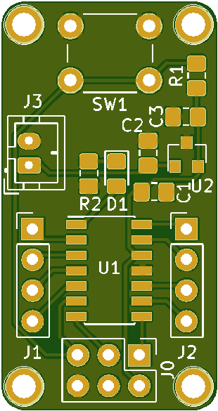

# hawk
Small ARM dev board based on ATSAMD10.

This repository takes a step-by-step look at creating a simple ATSAMD10-based dev-board using KiCAD.

## Contents

1. [Getting Started - Creating a Schematic.](https://github.com/MalphasWats/hawk/blob/master/articles/creating-the-schematic.markdown)
2. [Adding Battery Power.](https://github.com/MalphasWats/hawk/blob/master/articles/adding-battery-power.markdown)
3. [Footprints & Net-lists.](https://github.com/MalphasWats/hawk/blob/master/articles/footprints-and-netlists.markdown)
4. [Creating a PCB.](https://github.com/MalphasWats/hawk/blob/master/articles/creating-a-pcb.markdown)
5. [Aside: Designing a Board Outline.](https://github.com/MalphasWats/hawk/blob/master/articles/designing-board-outline.markdown)
6. [Component Layout.](https://github.com/MalphasWats/hawk/blob/master/articles/component-layout.markdown)
7. [Laying Traces.](https://github.com/MalphasWats/hawk/blob/master/articles/laying-traces.markdown)
8. [Filled Zones.](https://github.com/MalphasWats/hawk/blob/master/articles/filling-zones.markdown)
9. [Silkscreen.](https://github.com/MalphasWats/hawk/blob/master/articles/silkscreen.markdown)
10. [PCB Manufacture.](https://github.com/MalphasWats/hawk/blob/master/articles/pcb-manufacture.markdown)
